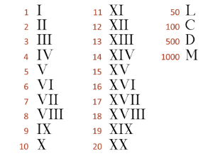

# Application Development 2 - Midterm Exam

This template repository is the starter project for App. Dev. 2 Midterm Exam. Written in Flutter/Dart.

### Question(s)

1. Write a Dart program to test if a given array of integers contains three increasing adjacent numbers. (5%)

Examples:

Input: [1, 4, 5, 6, 2]  
Output: true

Input: [1, 2, 7, 4, 5]  
Output: false

Input: [-4, -3, -2, -1, 0]  
Output: true

---

1. Write a Dart program that counts the highest number of a character in a given string. (5%)

Examples:

Input:  
absaaab

Output:

Key : a, Value : 4  
Key : b, Value : 2  
Key : s, Value : 1

Input:  
ice cream

Output:

Key : i, Value : 1  
Key : c, Value : 2  
Key : e, Value : 2  
Key : , Value : 1  
Key : r, Value : 1  
Key : a, Value : 1  
Key : m, Value : 1

---

1. Write a Dart program that converts an integer to its equivalent Roman literal. Here is a list of equivalencies: (10%)

Examples:

Input: 4  
Output: IV

Input: 19  
Output: XIX

Input: 158  
Output: CLVIII

Input: 530  
Output: DXXX
